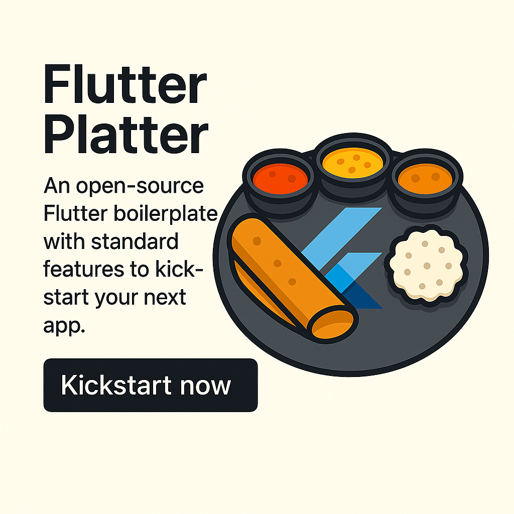

# 🍛 Flutter Platter

Flutter Platter is an open-source Flutter boilerplate project designed to kickstart your next idea faster. It comes packed with essential features, high-quality code, best practices, and a clean architecture to help you build scalable Flutter apps with ease.

---

## 🚀 Features

- **Authentication** – Firebase/Auth-ready login system
- **Notifications** – Push & local notifications setup
- **Analytics** – Integrated analytics tracking
- **Error Handling** – Global error handling with logging
- **State Management** – Configurable with Provider, Riverpod, or Bloc
- **Routing** – Scalable navigation with gorouter
- **Dependency Injection** – Built-in GetIt / Injectable support
- **Shared Preferences** – Local storage for simple key-value pairs
- **Responsive Design** – UI that adapts to screen sizes

---

## 🧑‍🍳 Why "Platter"?

Just like an Indian thali 🍽️, Flutter Platter serves you a well-balanced mix of all the components needed to build a Flutter app, ready to consume and extend.

---

## 📱 Screenshots

<div align="center">
  
</div>

---

## 🛠️ Getting Started

```bash
# Clone the repository
git clone https://github.com/Rohith01/flutter_platter.git
cd flutter_platter

# initialize firebase
https://firebase.google.com/docs/flutter/setup?platform=android

#Change following values
1. Package Name
2. Google Signin and Captcha Keys - kWebRecaptchaSiteKey and kGoogleSigninClientId at lib/core/constants.dart


# Get dependencies
flutter clean
flutter pub get

# Run the app
flutter run
```

---

## 🧩 Folder Structure

```
lib/
├── core/              # Error handling, utils, constants
├── presentation/      # Feature modules (auth, notifications, UI screens etc.)
├── services/          # Shared services (e.g., API, storage)
├── theme/             # App theming and UI config
├── main.dart          # App entry point
```

---

## 🤝 Contributing

We welcome contributions! Please see [CONTRIBUTING.md](CONTRIBUTING.md) for guidelines on how to get involved.

---

## 📄 License

This project is licensed under the MIT License. See the [LICENSE](LICENSE) file for details.

---

## 🌐 Connect

Have suggestions or want to collaborate?

- Raise an issue or PR
- Tweet using **#FlutterPlatter**
- Drop a ⭐ if this helped you!

> Eat, code, and ship. 🧑‍🍳🚀
